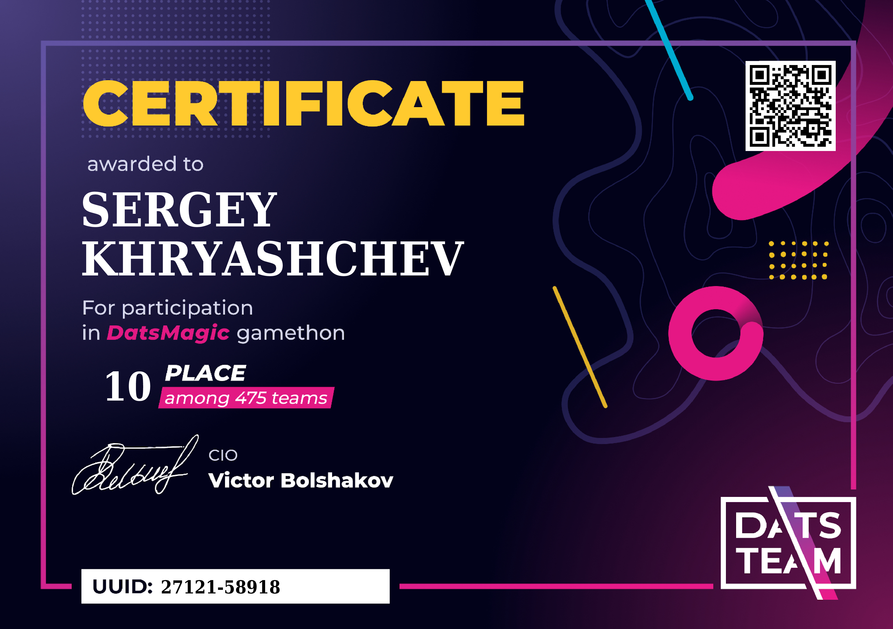
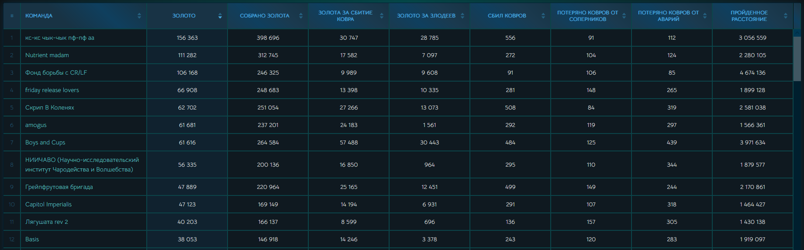
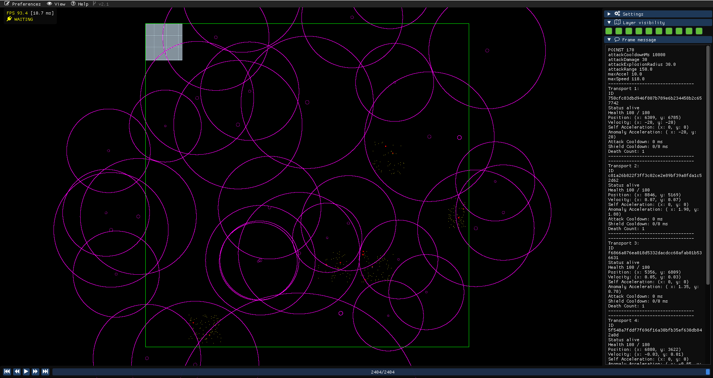
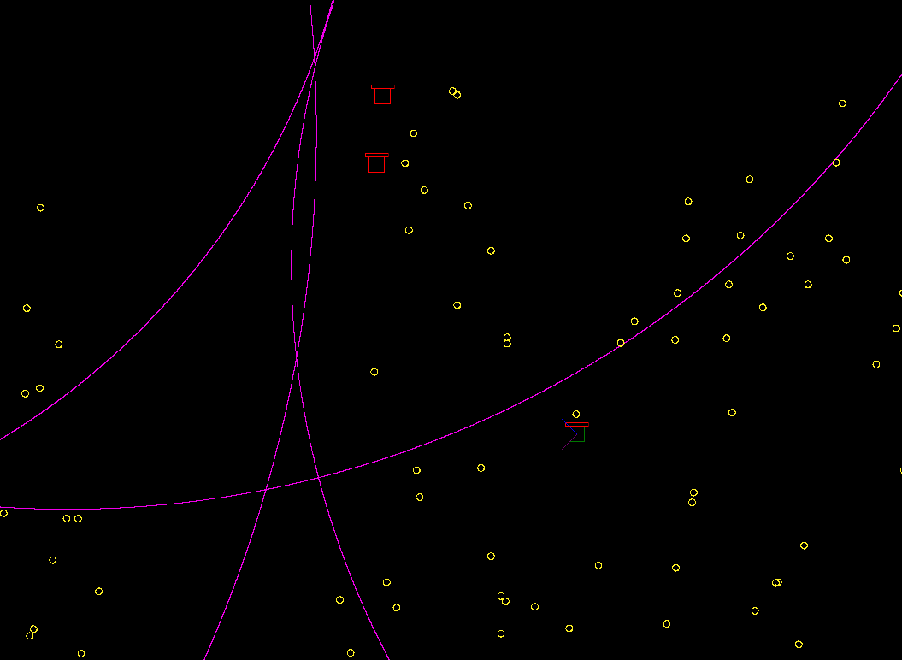

# DatsMagic Gamethon


Этот репозиторий содержит клиент, настроенный для участия в gamethon'е [DatsMagic](https://datsteam.dev/datsmagic#promo) от компании DatsTeam. Приложение разработано с использованием Python, а также специальной утилиты [Rewind Viewer](https://github.com/kswaldemar/rewind-viewer) для создания и отрисовки графического интерфейса. Клиент взаимодействует с игровым сервером при помощи API, обрабатывает поступающие json-словари с данными о состоянии окружающих объектов и осуществляет автоматизированное управление собственными объектами в игровом мире.  

[Документация проекта](https://gamethon.datsteam.dev/datsmagic/documentation/)  
[Статистика](https://datsteam.dev/datsmagic/magicstats)

Данное решение задачи хакатона, позволило моей команде Capitol Imperialis занять 10 место в финальном зачёте, среди [475 участников](https://datsteam.dev/datsmagic#teams).




## Описание

Клиент осуществляет следующую логику действий:

- Запрашивает данные о текущих игровых раундах; перемещениях аномалий, врагов, собственных транспортов и текущем местоположении наград (монет).
- Логирует информацию для каждого отдельного транспорта, включая здоровье, местоположение, скорость, ускорение, возможность атаки, активность щита и счётчик смертей. Также в режиме настоящего времени ведёт отчёт об общей статистике игрока.
- Визуализирует данные на карте, включая аномалии, врагов, союзные транспорты и монеты, используя клиентскую утилиту для графики.
- Автоматизированно управляет действиями транспортов, основываясь на логике игры и выработанной стратегии поведения.

## Панель управления и визуализация объектов




## Установка и локальный запуск

1. Клонируйте репозиторий и перейдите в него через командную строку:
```bash
git clone git@github.com:Khryashoff/DatsMagic-Gamethon.git
```
2. Установите и активируйте виртуальное окружение для проекта:
```bash
python -m venv venv
```
```bash
# для ОС Windows
. venv/Scripts/activate
```
3. Обновите pip и установите зависимости из файла requirements.txt:
```bash
python -m pip install --upgrade pip
```
```bash
pip install -r requirements.txt
```
4. Перейдите на страницу утилиты [Rewind viewer](https://github.com/kswaldemar/rewind-viewer/releases) на GitHub и загрузите последнюю актуальную версию 2.1.
5. Распакуйте содержимое архива rewindviewer_win_2_1.zip и перейдите в полученную папку:
```bash
tar -xf rewindviewer_win_2_1.zip -C . 
```
```bash
cd rewindviewer_win_2_1
```
6. Запустите исполняемый файл rewindviewer.exe:
```bash
rewindviewer.exe
```
7. Создайте в локальной папке репозитория файл .env и добавьте туда токен авторизации:
```bash
echo API_TOKEN=your_X-Auth-Token > .env
```
8. В функции def main, замените значение response на mock-файл с данными:
```python 
response = fetch_map_data(transports) -> response = fetch_map_data_mock(transports)
```
9. Запустите файл client.py:
```bash
python client.py
```
10. Перейдите в интерфейс запущенной утилиты Rewind viewer.

## Примеры запросов и ответов

```http
GET https://games.datsteam.dev/rounds/magcarp
```

```http
POST https://games.datsteam.dev/play/magcarp/player/move
```

```json
{
  "transports": [
    {
      "acceleration": {
        "x": 1.2,
        "y": 1.2
      },
      "activateShield": true,
      "attack": {
        "x": 1,
        "y": 1
      },
      "id": "00000000-0000-0000-0000-000000000000"
    }
  ]
}
```

```json
{
  "anomalies": [
    {
      "effectiveRadius": 0,
      "id": "string",
      "radius": 0,
      "strength": 0,
      "velocity": {
        "x": 1.2,
        "y": 1.2
      },
      "x": 1,
      "y": 1
    }
  ],
  "attackCooldownMs": 1000,
  "attackDamage": 10,
  "attackExplosionRadius": 10,
  "attackRange": 10,
  "bounties": [
    {
      "points": 100,
      "radius": 10,
      "x": 1,
      "y": 1
    }
  ],
  "enemies": [
    {
      "health": 100,
      "killBounty": 10,
      "shieldLeftMs": 5000,
      "status": "alive",
      "velocity": {
        "x": 1.2,
        "y": 1.2
      },
      "x": 1,
      "y": 1
    }
  ],
  "mapSize": {
    "x": 1,
    "y": 1
  },
  "maxAccel": 1,
  "maxSpeed": 10,
  "name": "player1",
  "points": 100,
  "reviveTimeoutSec": 2,
  "shieldCooldownMs": 10000,
  "shieldTimeMs": 5000,
  "transportRadius": 5,
  "transports": [
    {
      "anomalyAcceleration": {
        "x": 1.2,
        "y": 1.2
      },
      "attackCooldownMs": 0,
      "deathCount": 0,
      "health": 100,
      "id": "00000000-0000-0000-0000-000000000000",
      "selfAcceleration": {
        "x": 1.2,
        "y": 1.2
      },
      "shieldCooldownMs": 0,
      "shieldLeftMs": 0,
      "status": "alive",
      "velocity": {
        "x": 1.2,
        "y": 1.2
      },
      "x": 1,
      "y": 1
    }
  ],
  "wantedList": [
    {
      "health": 100,
      "killBounty": 10,
      "shieldLeftMs": 5000,
      "status": "alive",
      "velocity": {
        "x": 1.2,
        "y": 1.2
      },
      "x": 1,
      "y": 1
    }
  ]
}
```

## Разработчики проекта
Денис Леонтьев [(sadcatofficial)](https://github.com/sadcatofficial)  
Сергей Хрящев [(Khryashoff)](https://github.com/Khryashoff)